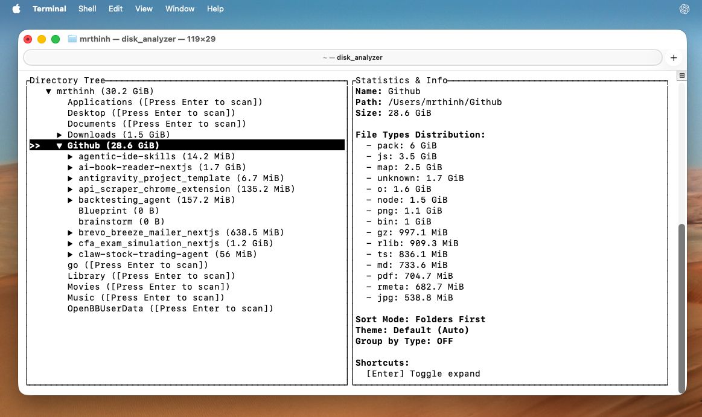

# Disk Analyzer (Công cụ Dọn dẹp Ổ đĩa Siêu Tốc)

> 🇬🇧 [English documentation](#english-version) is available in the second half of this document. (Tài liệu tiếng Anh ở nửa sau của tài liệu này).

Disk Analyzer là một ứng dụng vô cùng gọn nhẹ và siêu nhanh giúp bạn tìm ra những thư mục, tệp tin đang chiếm nhiều dung lượng nhất trên máy tính (hoặc trên Google Drive). Chỉ với vài phím bấm, bạn có thể dọn dẹp ổ đĩa của mình một cách an toàn và lấy lại hàng chục GB không gian lưu trữ!

## 🌟 Tính Năng Nổi Bật

* **Siêu Nhanh & Nhẹ:** Ứng dụng chạy trực tiếp, không cần cài đặt phức tạp, tốc độ quét đĩa cực nhanh nhờ ngôn ngữ lập trình Rust.
* **Trực Quan & Dễ Nhìn:** Hiển thị danh sách các thư mục lớn nhất dưới dạng cây thư mục. Thư mục nào có dung lượng lớn sẽ xếp trên đầu.
* **Tìm Nhanh:** Gõ từ khoá để tìm kiếm thư mục ngay lập tức.
* **Xóa An Toàn:** Hỗ trợ phím tắt xóa file/thư mục rác ngay lập tức với 2 bước xác nhận, tránh xóa nhầm.
* **Dọn Dẹp Google Drive:** Hỗ trợ chạy trực tiếp trên Google Colab, giúp bạn quét và dọn dẹp Google Drive cực nhanh mà không cần đồng bộ file về máy tính.

***

## 🚀 Hướng Dẫn Tải & Chạy (Cho Máy Tính)

Bạn không cần cài đặt bất kỳ phần mềm rườm rà nào. Chỉ cần tải ứng dụng về và chạy!

### Dành cho Windows

1. Tải file: [disk_analyzer-windows-amd64.exe](./releases/disk_analyzer-windows-amd64.exe)
2. **Cách chạy:** Nhấn đúp chuột (double-click) vào file `.exe` vừa tải về. Ứng dụng sẽ tự động mở lên.

### Dành cho macOS (MacBook chip M1, M2...)

1. Tải file: [disk_analyzer-macos-arm64](./releases/disk_analyzer-macos-arm64)
2. **Cách chạy:**
   * Mở ứng dụng **Terminal** (bấm `Cmd + Space` và gõ Terminal).
   * Kéo và thả file vừa tải vào cửa sổ Terminal, sau đó bấm `Enter`.
     *(Lần đầu tiên chạy, bạn có thể cần gõ lệnh `chmod +x đường_dẫn_đến_file` để cấp quyền chạy file).*



### Dành cho macOS (Intel) hoặc Linux

* Làm tương tự như MacBook chip M. Hãy tải phiên bản phù hợp trong thư mục [`releases/`](./releases).

***

## ☁️ Tuyệt Chiêu: Dọn dẹp Google Drive bằng Google Colab

Nếu Google Drive của bạn sắp hết dung lượng, việc quét tìm file rác bằng máy tính sẽ rất chậm vì phải tải dữ liệu qua mạng. Thay vào đó, bạn có thể dùng Disk Analyzer trực tiếp trên hệ thống của Google (Colab) với tốc độ chớp nhoáng!

**Bước 1:** Mở [Google Colab](https://colab.research.google.com/) và tạo một Sổ tay mới (New Notebook).

**Bước 2:** Kết nối với Google Drive của bạn bằng cách chạy đoạn mã sau trong ô đầu tiên:

```python
from google.colab import drive
drive.mount('/content/drive')
```

*(Google sẽ hỏi quyền truy cập, hãy bấm Cho phép).*

**Bước 3:** Tải công cụ Disk Analyzer (bản dành cho Linux) về Colab. Chạy mã sau ở ô tiếp theo:

```bash
!wget https://raw.githubusercontent.com/thinh-vu/disk_analyzer/main/releases/disk_analyzer-linux-amd64
!chmod +x disk_analyzer-linux-amd64
```

**Bước 4:** Quét toàn bộ ổ đĩa Google Drive của bạn:

```bash
!./disk_analyzer-linux-amd64 /content/drive/MyDrive
```

**Lợi ích:** Quét hàng trăm GB trên Google Drive chỉ trong vài giây! Bạn có thể xem thư mục nào đang chiếm nhiều chỗ nhất và xóa chúng đi.

***

## ⌨️ Cách Sử Dụng Căn Bản

Khi ứng dụng đã mở lên, bạn chỉ cần dùng bàn phím để thao tác:

* **Mũi tên Lên / Xuống:** Di chuyển chọn thư mục.
* **Phím Enter (hoặc Mũi tên Phải):** Mở xem bên trong thư mục.
* **Phím Backspace (hoặc Mũi tên Trái):** Quay lại thư mục bên ngoài.
* **Phím Delete (hoặc phím `x`):** Xóa thư mục/tệp đang chọn (Ứng dụng sẽ hỏi lại lần nữa để xác nhận, hãy gõ `y` để đồng ý).
* **Phím `?`:** Xem bảng danh sách toàn bộ các phím tắt.
* **Phím `q` (hoặc `Esc`):** Thoát ứng dụng.

***

<a id="english-version"></a>

# 🇬🇧 Disk Analyzer - English

A blazingly fast, incredibly lightweight disk usage analyzer. It helps you quickly identify and clean up the heaviest folders and files taking up space on your computer (or Google Drive). With just a few keystrokes, you can safely clean up your disk and reclaim gigabytes of storage!

## 🌟 Key Features

* **Super Fast & Lightweight:** Runs directly without complex installations. It scans your disk at blazing speeds thanks to modern core technology.
* **Visual & Easy to Read:** Displays your largest folders in an intuitive tree view. The heaviest folders are always sorted at the top.
* **Instant Search:** Type to filter and find folders instantly.
* **Safe Deletion:** Delete junk files/folders instantly with a two-step confirmation to prevent accidental data loss.
* **Google Drive Cleanup (Special):** Run it directly on Google Colab to scan and clean your Google Drive at lightning speed without downloading files to your local machine.

***

## 🚀 Installation & Usage (For Computers)

No installation required! Just download the application and run it.

### For Windows

1. Download: [disk_analyzer-windows-amd64.exe](./releases/disk_analyzer-windows-amd64.exe)
2. **How to run:** Double-click the downloaded `.exe` file.

### For macOS (Apple Silicon / M1, M2...)

1. Download: [disk_analyzer-macos-arm64](./releases/disk_analyzer-macos-arm64)
2. **How to run:**
   * Open **Terminal** (`Cmd + Space` and type Terminal).
   * Drag and drop the downloaded file into the Terminal window, then press `Enter`.
     *(For the first run, you might need to grant execute permissions by typing `chmod +x /path/to/file` before running).*

### For macOS (Intel) or Linux

* Follow the same steps as Apple Silicon. Just download the appropriate version from the [`releases/`](./releases) folder.

***

## ☁️ Pro Tip: Clean up Google Drive using Google Colab

If your Google Drive is running out of space, scanning it from your local computer is slow due to network constraints. Instead, run Disk Analyzer directly on Google's cloud servers (Colab) for instant results!

**Step 1:** Open [Google Colab](https://colab.research.google.com/) and create a New Notebook.

**Step 2:** Mount your Google Drive by running this Python code in the first cell:

```python
from google.colab import drive
drive.mount('/content/drive')
```

*(Google will ask for permission, click Allow).*

**Step 3:** Download the Linux version of Disk Analyzer to Colab by running this in the next cell:

```bash
!wget https://raw.githubusercontent.com/thinh-vu/disk_analyzer/main/releases/disk_analyzer-linux-amd64
!chmod +x disk_analyzer-linux-amd64
```

**Step 4:** Scan your entire Google Drive:

```bash
!./disk_analyzer-linux-amd64 /content/drive/MyDrive
```

**Benefits:** Scan hundreds of GBs on Google Drive in seconds! Find the heaviest folders and clean them up easily.

***

## ⌨️ Basic Controls

Once the app is open, use your keyboard to navigate:

* **Up / Down arrows:** Move up and down the list.
* **Enter (or Right arrow):** Open and view inside a folder.
* **Backspace (or Left arrow):** Go back to the parent folder.
* **Delete (or `x` key):** Delete the selected folder/file (The app will ask for confirmation, type `y` to proceed).
* **`?` key:** Open the help menu to see all shortcuts.
* **`q` key (or `Esc`):** Quit the application.
